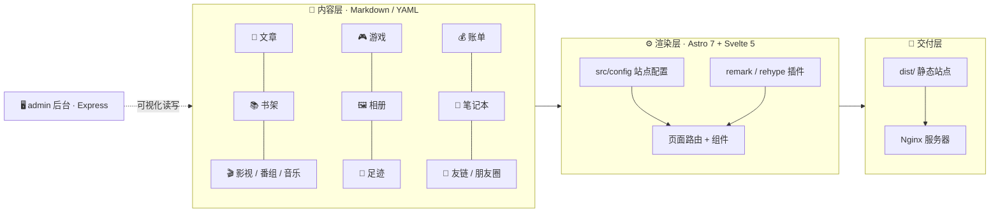
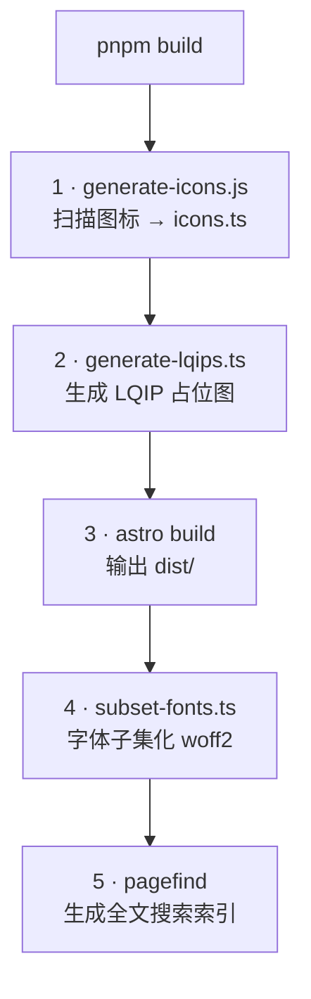
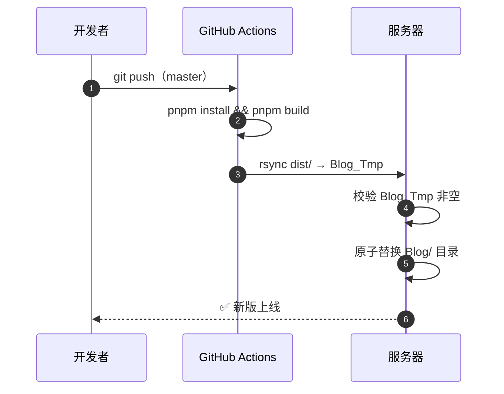

<div align="center">

<!-- https://readme-typing-svg.demolab.com 可以编辑渲染文本 -->
[](https://git.io/typing-svg)

[](https://git.io/typing-svg)

<!-- 仓库状态 -->
[](https://github.com/LuvGaze/Blog/stargazers)
[](https://github.com/LuvGaze/Blog/network/members)
[](https://github.com/LuvGaze/Blog/issues)
[](https://github.com/LuvGaze/Blog/commits)
[](https://github.com/LuvGaze/Blog)

<!-- 技术栈 -->


<br/>

**<a href="https://LuvGaze.com">🌐 在线预览</a> · <a href="https://github.com/LuvGaze/Blog-Admin">🖥️
后台仓库</a> · <a href="https://github.com/CuteLeaf/Firefly">🔥 上游主题</a>**

</div>

> [!NOTE]
> **LuvGaze Blog** 是一个基于 [Firefly](https://github.com/CuteLeaf/Firefly) 深度二次开发的现代化个人博客。
> 文章、书架、影视、番组、游戏、音乐、相册、足迹、账单、更新日志、笔记本……**全部内容用 Markdown / YAML 托管**，
> 并配备 **Express + TypeScript 可视化后台** 与 **脚本化构建流水线**，改内容不用碰一行代码。

---

## ✨ 特性亮点

### 🧱 架构总览



### 🎨 视觉与交互

- **单主色主题体系** —— 只需在 `siteConfig.themeColor.color` 填一个 16 进制主色，全套色族由色相自动推导（OKLCH）。
- **毛玻璃 + 悬浮胶囊导航** —— 三段式椭圆导航、滚动收缩、滑动高亮、明暗自适应。
- **动态壁纸** —— 图片 / 视频横幅，多种覆盖模式，全屏透明卡片。
- **趣味特效** —— 樱花飘落 🌸、打字机文本 ⌨️、图片像素揭示动画、Fancybox 灯箱、Live2D / Spine 看板娘。
- **深色 / 浅色主题** —— 一键切换并跟随系统。

### 🧩 页面模块

| 页面         | 亮点                                |
|------------|-----------------------------------|
| 🏠 首页      | 横幅、公告、多源聚合「最近更新」、侧栏小组件            |
| 📝 文章列表    | 置顶轮播 + 网格/列表切换 + 客户端分页 + 封面像素揭示   |
| 📄 文章详情    | 面包屑、hero 标题、AI 摘要卡、目录、推荐阅读、评论与访问量 |
| 📚 3D 书架   | 书籍卡片 3D 悬浮翻转，按阅读状态 / 评分排序         |
| 🎬 影视 · 游戏 | 分类筛选与评分，按状态 / 类型排序                |
| 🖼️ 相册     | 瀑布流 + PhotoSwipe 查看器              |
| 🧭 足迹地图    | 高德地图，省 / 市界随缩放显示，悬浮高亮与点亮插件        |
| 💰 账单      | 收支流水、月度统计、分类排行仪表盘                 |
| 🕘 更新日志    | 日期 + 版本号排序，链路图谱视图                 |
| 🤝 友链      | 参考风格截图卡片（7:5），支持自定义分组             |

### 🛠️ 工程化

- **双层响应式侧边栏**：左右栏组件化，可配置归属、排序、粘性定位与文章页显隐。
- **侧栏小组件**：天气（三列整组轮换 · AQI 分色 · 气压）、恋爱计时器、音乐播放器、日历、公告。
- **构建期自动化**：图标按需内联、LQIP 占位图、字体子集化、Pagefind 全文搜索索引。
- **全站访问口令**：受保护页面（含账单）共用一套口令，由环境变量注入。
- **内容 schema 校验**：`src/content.config.ts` 统一约束所有集合字段。

---

## 📚 内容模块

所有内容均以 Markdown / YAML 存放于 `src/content/`，新增内容 **无需编写代码**。

| 模块      | 目录                                        | 说明                                        |
|---------|-------------------------------------------|-------------------------------------------|
| 📝 文章   | `src/content/posts/`                      | Markdown、代码高亮、数学公式、文章加密（AES-256）          |
| 📚 书架   | `src/content/books/`                      | 封面、评分、阅读状态                                |
| 🎬 影视   | `src/content/movies/`                     | 电影 / 剧集 / 动漫 / 纪录片，分类与评分                  |
| 🔖 番组   | `src/content/movies/`                     | `category: real` + `subcategory: anime`   |
| 🎵 音乐   | `src/content/movies/`                     | Meting 接入音频、封面与自动歌词                       |
| 🎮 游戏   | `src/content/games/`                      | 游戏管理与评分                                   |
| 🖼️ 相册  | `src/content/gallery/`                    | `images` 数组或扫描本地目录                        |
| 🧭 足迹   | `src/content/travel/`                     | 高德足迹地图，`province` / `city` / `visitCount` |
| 📋 规划   | `src/content/plans/`                      | 待办规划，`updated` 记录修改时间                     |
| 💰 账单   | `src/content/bills/`                      | 收支流水，受全站口令保护                              |
| 🕘 更新日志 | `src/content/changelog/`                  | 版本记录，同日按版本号排序                             |
| 📓 笔记本  | `src/content/notebooks/`                  | 多级目录 + 单篇笔记，带封面                           |
| 🤝 友链   | `src/content/friends/` + `friend-groups/` | 截图卡片，支持自定义分组                              |
| 💬 朋友圈  | `src/content/moments/`                    | 短动态                                       |
| 🌐 导航   | `src/content/website/`                    | 站点收藏导航                                    |
| 📄 关于我  | `src/content/spec/`                       | `.mdx` 组件化内容                              |

> [!TIP]
> 各内容类型的字段写法与示例，可直接参考站内教程《博客功能使用教程》，或使用可视化后台 `admin/` 编辑。

---

## 🖥️ 管理后台

<div align="center">


</div>

`admin/` 目录内置一套 **独立运行的可视化后台**，直接读写博客的 `src/content/` 与 `src/config/`：

- **14 个内容模块**：文章 / 相册 / 笔记 / 书架 / 游戏 / 影视 / 友链 / 朋友圈 / 规划 / 旅行 / 账单 / 网站导航 / 更新日志 /
  关于我。
- **表单化编辑**：按字段定义自动渲染控件，YAML 引号与换行风格原样保留写回。
- **配置在线编辑**：站点、侧边栏、评论、音乐、页脚等 TS 配置结构化改写，保留注释与格式。
- **备份与恢复**：更新 / 删除自动备份，支持整模块快照与单条恢复。

`API/` 目录另提供一个基于 **Hono** 的轻量接口服务（默认端口 `9898`，可选）。

> [!WARNING]
> 后台首次登录后请立即修改管理员密码；`.env` 中的密钥切勿提交到仓库。

---

## 🔧 技术栈

<div align="center">


</div>

| 类别 | 技术                                              |
|----|-------------------------------------------------|
| 框架 | Astro 7 · Svelte 5                              |
| 样式 | Tailwind CSS 4 · 原生 CSS 变量主题                    |
| 语言 | TypeScript（strict）                              |
| 搜索 | Pagefind                                        |
| 图标 | 构建期按需内联 `material-symbols` / `fa7` / `mingcute` |
| 图像 | 构建期生成 LQIP 占位图 · Sharp                          |
| 图表 | Mermaid · PlantUML · KaTeX                      |
| 工程 | Biome · tsx · Swup（无刷新路由）                       |
| 后台 | Express 4 + TypeScript                          |
| 部署 | GitHub Actions → rsync / SSH → Nginx            |

---

## 🚀 快速开始

### 环境要求

```text
Node.js ≥ 20   （CI 使用 22）
pnpm    ≥ 9    （项目通过 only-allow 强制使用 pnpm）
```

### 前端博客

```bash
git clone https://github.com/LuvGaze/Blog.git
cd Blog

pnpm install     # 安装依赖
pnpm dev         # 开发服务器 → http://localhost:4321
pnpm build       # 生产构建 → dist/
pnpm preview     # 预览构建产物
```

### 可视化后台

```bash
cd admin
pnpm install
cp .env.example .env     # Windows: copy .env.example .env
pnpm dev                 # 后台 → http://localhost:8899/admin
```

### 常用脚本

| 命令                          | 说明                                    |
|-----------------------------|---------------------------------------|
| `pnpm dev` / `pnpm start`   | 启动开发服务器                               |
| `pnpm build`                | 生产构建（图标 + LQIP + Astro + 字体子集 + 搜索索引） |
| `pnpm preview`              | 预览构建产物                                |
| `pnpm check`                | Astro 类型与诊断检查                         |
| `pnpm type-check`           | 仅 TypeScript 检查                       |
| `pnpm new-post "标题"`        | 极速新建文章                                |
| `pnpm lint` / `pnpm format` | Biome 检查 / 格式化                        |
| `pnpm icons` / `pnpm lqips` | 单独生成图标 / LQIP                         |

### 构建流水线



> [!IMPORTANT]
> `src/constants/icons.ts`、`src/constants/lqips.json` 等为构建产物，已加入 `.gitignore`，**无需上传仓库**。

---

## 📁 项目结构

```text
Blog/
├── src/
│   ├── content/            # 📄 全部内容（Markdown / YAML）
│   ├── content.config.ts   # 内容集合 schema（字段定义）
│   ├── components/         # 布局 / 页面 / 特性组件
│   ├── config/             # 站点、主题、导航、评论、音乐、侧栏等配置
│   ├── pages/              # 页面路由与接口
│   ├── plugins/            # remark / rehype Markdown 插件
│   ├── styles/             # 全局与页面样式
│   ├── utils/  types/  constants/  i18n/
├── scripts/                # 构建 / 建站脚本
├── public/                 # 静态资源（足迹地图、看板娘模型等）
├── admin/                  # 🖥️ Express + TS 可视化管理后台
├── docs/                   # 文档与 Demo
└──.github/workflows/      # GitHub Actions 自动部署
```

---

## ⚙️ 核心配置

绝大多数功能无需改动组件逻辑，只需调整 `src/config/` 下的模块化配置：

<details>
<summary><b>展开查看核心配置文件</b></summary>

<br/>

| 文件                                      | 作用                                               |
|-----------------------------------------|--------------------------------------------------|
| `siteConfig.ts`                         | 站点信息、主色、页面宽度、卡片样式                                |
| `navBarConfig.ts`                       | 导航栏菜单结构与 `LinkPresets`                           |
| `sidebarConfig.ts`                      | 左右侧边栏组件、排序与开关                                    |
| `commentConfig.ts`                      | 评论系统（Twikoo / Waline / Artalk / Giscus / Disqus） |
| `musicConfig.ts`                        | 音乐播放器、歌单、Meting API                              |
| `footerConfig.ts` + `FooterConfig.html` | 页脚内容与版权开关                                        |
| `weatherConfig.ts`                      | 天气组件（城市、显示项）                                     |
| `relationshipConfig.ts`                 | 恋爱计时器（纪念日）                                       |
| `accessConfig.ts`                       | 全站访问口令与受保护路由                                     |
| `analyticsConfig.ts`                    | 统计服务（Google Analytics / Clarity / Umami / 51la）  |
| `coverImageConfig.ts`                   | 封面图与随机封面 API                                     |
| `effectsConfig.ts`                      | 动画特效（樱花等）                                        |
| `fontConfig.ts`                         | 字体与子集化配置                                         |
| `pioConfig.ts`                          | 看板娘（Spine / Live2D）                              |

</details>

---

## 🗺️ 环境变量

足迹地图依赖高德（AMap）JS API，构建期需注入以下变量（本地写入 `.env`，CI 通过仓库 Secrets 注入）：

```dotenv
PUBLIC_AMAP_KEY_PLACES=你的高德 Web 端 Key
PUBLIC_AMAP_SECURITY_JS_CODE=对应的安全密钥
PUBLIC_AMAP_GEO_KEY=你的高德 Web 服务 Key
PUBLIC_AMAP_GEO_SECRET=对应的安全密钥
GATE_PASSWORD=全站访问口令
```

> [!WARNING]
> 缺少安全码会导致地图底图白屏；`GATE_PASSWORD` 保护账单等受限页面，请使用足够复杂的口令。

---

## 📦 部署

推送 `master` 分支即触发 [`.github/workflows/deploy.yml`](.github/workflows/deploy.yml)：构建 → rsync
增量同步到服务器临时目录 → 校验非空 → **原子替换** 线上目录，实现零停机发布。



在 **Settings → Secrets and variables → Actions** 中配置以下 Secrets：

| Secret                                                    | 用途                  |
|-----------------------------------------------------------|---------------------|
| `PUBLIC_AMAP_KEY_PLACES` / `PUBLIC_AMAP_SECURITY_JS_CODE` | 足迹地图 Web 端 Key 与安全码 |
| `PUBLIC_AMAP_GEO_KEY` / `PUBLIC_AMAP_GEO_SECRET`          | 地理编码 Web 服务 Key 与密钥 |
| `GATE_PASSWORD`                                           | 全站访问口令              |
| `SSH_PRIVATE_KEY` / `SERVER_HOST` / `SERVER_PORT`         | 服务器部署凭据             |

> [!NOTE]
> 也可 `pnpm build` 后手动将 `dist/` 部署到任意静态托管或对象存储。

---

## ❓ 常见问题

<details>
<summary><b>构建报错找不到 <code>icons.ts</code> / <code>lqips.json</code>？</b></summary>

<br/>

这两个文件是构建产物。执行 `pnpm icons` 与 `pnpm lqips` 生成，或直接跑完整的 `pnpm build`。

</details>

<details>
<summary><b>足迹地图 / 账单页白屏或无法访问？</b></summary>

<br/>

检查 `.env` 中的高德 Key、安全码是否完整，以及 `GATE_PASSWORD` 是否正确注入。

</details>

<details>
<summary><b>可以把它当作博客模板使用吗？</b></summary>

<br/>

可以。项目基于 [Firefly](https://github.com/CuteLeaf/Firefly)（MIT 协议），请保留原作者版权声明；本站个性化内容（
`src/content/`、`src/config/`）请替换为你自己的。

</details>

---

## ⭐ Star History

<div align="center">

[](https://star-history.com/#LuvGaze/Blog&Date)

[](https://github.com/LuvGaze/Blog)

</div>

---

## 🙏 致谢

本项目站在这些优秀开源项目的肩膀上：

- 🔥 [Firefly](https://github.com/CuteLeaf/Firefly) —— 上游主题（二次开发基础）
- 🎨 [saicaca / Fuwari](https://github.com/saicaca/fuwari) —— 更早的灵感来源
-
📜 [Astro](https://astro.build) · [Svelte](https://svelte.dev) · [Tailwind CSS](https://tailwindcss.com) · [Pagefind](https://pagefind.app)

---

## 📄 许可协议

本项目遵循 [MIT License](LICENSE) 开源协议。

```text
Copyright (c) 2026 LuvGaze
Copyright (c) 2025 CuteLeaf
Copyright (c) 2024 saicaca
```

<div align="center">

[](https://git.io/typing-svg)

</div>