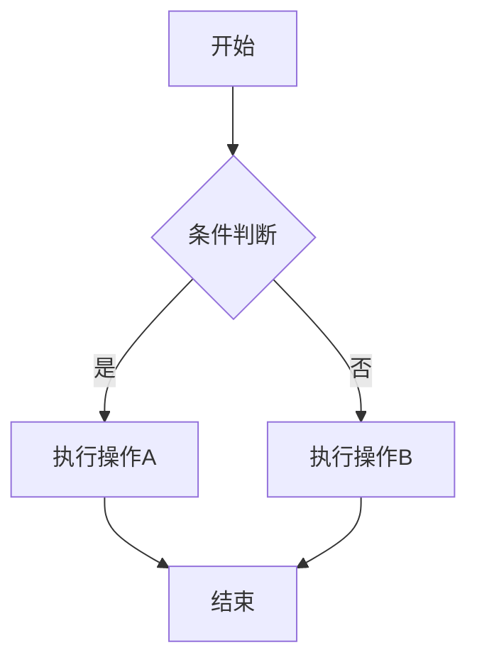
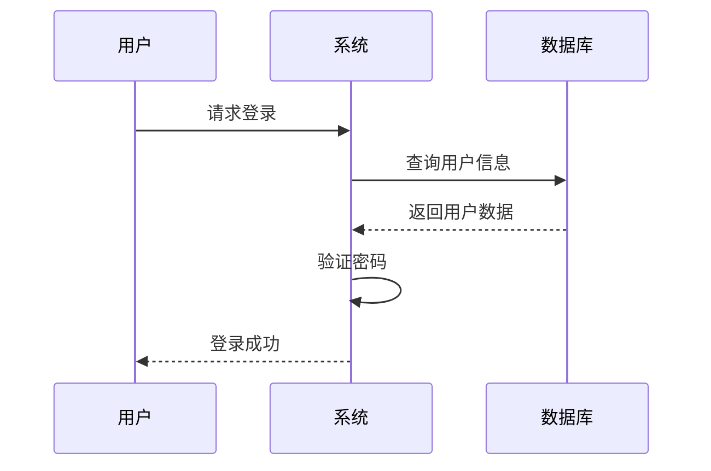
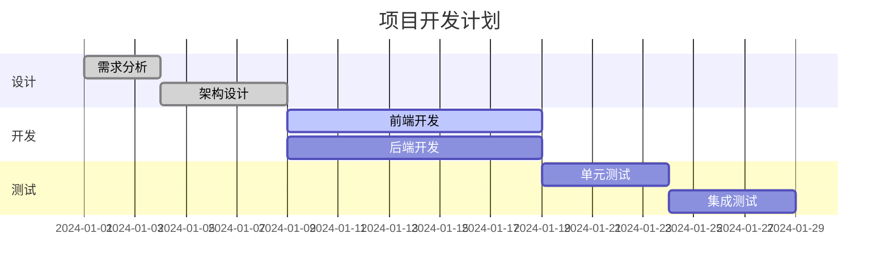
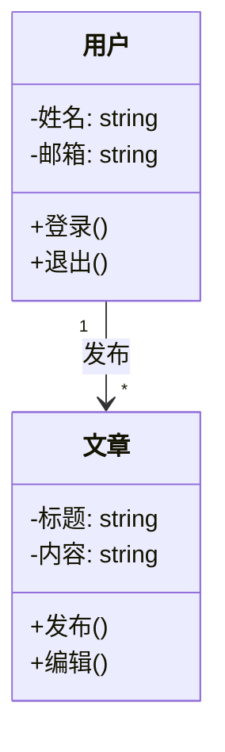
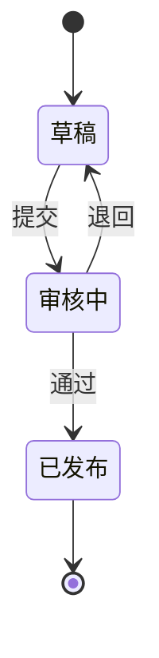
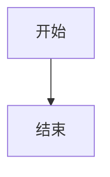

## Markdown 中 Mermaid 图表完整指南

本文演示如何在 Markdown 文档中使用 Mermaid 创建各种复杂图表，包括流程图、时序图、甘特图、类图和状态图。

## 流程图示例

流程图非常适合表示流程或算法步骤。



## 时序图示例

时序图用于展示对象之间的交互顺序。



## 甘特图示例

甘特图用于项目进度管理。



## 类图示例

类图用于展示类之间的关系。



## 状态图示例

状态图用于展示对象的状态变化。



## 使用方法

在 Firefly 博客中，您只需在 Markdown 代码块中使用 `mermaid` 语言标识，即可渲染 Mermaid 图表：

```markdown

```

Firefly 会自动处理 Mermaid 图表的渲染，支持亮暗主题切换，并提供图表的缩放和拖拽功能。
