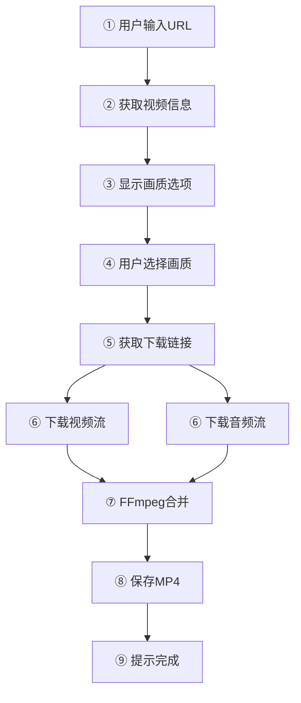
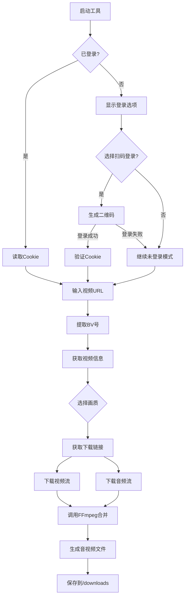

---
# 一、获取搜索页面结构


## 1. 导入所需库
```python
import requests               # 发送HTTP请求
from urllib.parse import quote  # URL编码关键词
from bs4 import BeautifulSoup   # 解析HTML
import random                  # 随机延迟和UA选择
import time                    # 控制请求间隔
```

---

## 2. 构建搜索URL函数
```python
def build_search_url(keyword, page=1):
    """
    构造B站搜索URL
    :param keyword: 搜索关键词
    :param page: 页码(默认第1页)
    :return: 完整的搜索URL
    """
    base_url = "https://search.bilibili.com/all"
    encoded_keyword = quote(keyword)  # 将关键词转为URL安全格式(如"Python教程" -> "Python%E6%95%99%E7%A8%8B")
    return f"{base_url}?keyword={encoded_keyword}&page={page}"  # 拼接完整URL
```
![[Pasted image 20250817162707.png]]

---

## 3. 发送HTTP请求函数
```python
def fetch_search_page(url):
    """
    获取搜索页HTML内容
    :param url: 构造好的搜索URL
    :return: HTML文本或None(失败时)
    """
    # 随机延迟1-3秒，模拟人类操作
    time.sleep(random.uniform(1, 3))  
    
    # 请求头设置
    headers = {
        "User-Agent": "Mozilla/5.0 (Windows NT 10.0; Win64; x64) AppleWebKit/537.36...",  # 伪装浏览器
        "Referer": "https://www.bilibili.com/",  # 标记来源页面
        "Accept-Language": "zh-CN,zh;q=0.9"     # 语言偏好
    }
    
    try:
        # 发送GET请求，超时10秒
        response = requests.get(url, headers=headers, timeout=10)
        response.raise_for_status()  # 检查HTTP状态码(非200抛出异常)
        
        # 简单反爬检查：验证码页面通常较短
        if len(response.text) < 5000 or "验证" in response.text:
            raise Exception("触发反爬机制")
            
        return response.text
    except Exception as e:
        print(f"请求失败: {e}")
        return None
```

---

## 4. 解析HTML函数
```python
def parse_video_items(html):
    """
    从HTML中提取视频信息
    :param html: 网页HTML文本
    :return: 视频信息列表
    """
    soup = BeautifulSoup(html, "html.parser")  # 创建BeautifulSoup对象
    video_items = []  # 存储结果的列表
    
    # 定位所有视频条目（新旧版B站选择器兼容）
    items = soup.select("li.video-item, div.bili-video-card")
    
    for item in items:  # 遍历每个视频条目
        try:
            # --- 提取标题 ---
            # 先尝试找带title属性的<a>标签，找不到则找<h3>标签
            title_elem = item.find("a", {"title": True}) or item.find("h3", {"title": True})
            title = title_elem["title"] if title_elem else "无标题"
            
            # --- 提取视频链接 ---
            link_elem = item.find("a", href=True)  # 找带href的<a>标签
            if link_elem:
                video_url = link_elem["href"]
                # 处理相对URL
                if video_url.startswith("//"):
                    video_url = "https:" + video_url  # 补全协议
                elif not video_url.startswith("http"):
                    video_url = "https://www.bilibili.com" + video_url  # 补全域名
            
            # --- 提取UP主 ---
            # 兼容新旧版class名
            up_elem = item.find(class_="up-name") or item.find(class_="bili-video-card__info--author")
            up_name = up_elem.get_text(strip=True) if up_elem else "未知UP主"
            
            # --- 提取播放量 ---
            play_elem = item.find(title="观看") or item.find(class_="play") 
            play_count = play_elem.get_text(strip=True) if play_elem else "0"
            
            # --- 提取时长 ---
            duration_elem = item.find(class_="length") or item.find(class_="bili-video-card__stats__duration")
            duration = duration_elem.get_text(strip=True) if duration_elem else ""
            
            # 将信息存入字典并添加到结果列表
            video_items.append({
                "title": title,
                "url": video_url,
                "up": up_name,
                "play": play_count,
                "duration": duration
            })
        except Exception as e:
            print(f"解析视频条目失败: {e}")
            continue  # 单个条目解析失败不影响整体
            
    return video_items
```

- 以关键词“音乐”为例，查看其页面源代码

![[Pasted image 20250817161338.png]]

- 找到 a href 、bili-video-card__info--author 、bili-video-card__info--date 、play 、bili-video-card__stats__duration 标签，获取其BV值、作者、发布日期、播放量、时长数据

![[Pasted image 20250817163000.png]]

---

## 5. 主搜索函数
```python
def search_videos(keyword, max_results=50):
    """
    主搜索函数
    :param keyword: 搜索关键词
    :param max_results: 最大结果数(默认50)
    :return: 视频信息列表
    """
    all_videos = []  # 所有结果
    page = 1         # 从第1页开始
    
    while len(all_videos) < max_results:
        # 1. 构造当前页URL
        url = build_search_url(keyword, page=page)
        
        # 2. 获取页面HTML
        html = fetch_search_page(url)
        if not html:  # 获取失败则终止
            break
            
        # 3. 解析当前页视频
        videos = parse_video_items(html)
        if not videos:  # 无结果则终止
            break
            
        # 4. 合并结果
        all_videos.extend(videos)
        page += 1  # 准备获取下一页
        
        # 5. 检查是否达到需求
        if len(all_videos) >= max_results:
            break
            
    return all_videos[:max_results]  # 返回指定数量的结果
```

---

## 6. 使用示例
```python
if __name__ == "__main__":
    # 搜索"Python教程"，最多获取50条结果
    results = search_videos("Python教程", max_results=50)
    
    # 打印结果
    for i, video in enumerate(results, 1):
        print(f"{i}. {video['title']}")
        print(f"   UP主: {video['up']}")
        print(f"   播放量: {video['play']}")
        print(f"   时长: {video['duration']}")
        print(f"   链接: {video['url']}\n")
```

---

## 7.部分关键代码

### 1. URL编码的重要性
```python
encoded_keyword = quote("Python 教程") 
# 输出: "Python%20%E6%95%99%E7%A8%8B"
```
- 不同编译器、环境、库函数的版本可能导致使用的编码不同
- 将特殊字符（如中文、空格）转为URL安全格式
- 避免服务器接收错误的关键词


https://search.bilibili.com/all?vt=86155476&keyword=%E9%9F%B3%E4%B9%90

### 2. 反爬处理三要素
```python
time.sleep(random.uniform(1, 3))           # 随机延迟
headers = {"User-Agent": "..."}           # 伪装浏览器
response.raise_for_status()               # 检查请求是否成功
```

### 3. 加强HTML解析
```python
# 多重选择器确保兼容性
items = soup.select("li.video-item, div.bili-video-card")

# 防御性编程
title = title_elem["title"] if title_elem else "无标题"
```

### 4. 分页控制逻辑
```python
while len(all_videos) < max_results:  # 结果不足时继续
    page += 1  # 翻页
    if not videos: break  # 无结果时终止
```

---

# 二、视频下载模块

## 1. BV号提取函数
```python
def extract_bvid(url):
    # 处理B站短链接（如b23.tv格式）
    if "b23.tv" in url:  # 检查是否是短链接
        # 请求短链接但不自动跳转（allow_redirects=False）
        # 从响应头中获取真实地址（location字段）
        url = requests.get(url, allow_redirects=False).headers.get('location', url)
    
    # 使用正则表达式从URL中提取BV号
    # BV号格式：BV开头，后接10-12位字母数字组合
    match = re.search(r'(BV[0-9A-Za-z]+)', url)
    
    if not match:  # 如果未匹配到BV号
        raise ValueError("URL中未找到有效的BV号")  # 抛出异常
    
    return match.group(1)  # 返回第一个捕获组（即BV号）
```

## 2. 获取视频信息函数
```python
def get_video_info(video_url, cookie=""):
    # 提取BV号
    bvid = extract_bvid(video_url)
    
    # 构造请求头
    headers = {
        "User-Agent": "Mozilla/5.0...",  # 伪装成浏览器
        "Referer": f"https://www.bilibili.com/video/{bvid}"  # 必须设置来源页
    }
    
    # 如果提供了cookie，添加到请求头
    if cookie:
        headers["Cookie"] = cookie
    
    # 请求1：获取视频基本信息
    info_url = f"https://api.bilibili.com/x/web-interface/view?bvid={bvid}"
    info = requests.get(info_url, headers=headers, timeout=10).json()
    
    # 检查API返回状态码
    if info['code'] != 0:
        raise ValueError(f"获取视频信息失败: {info.get('message')}")
    
    # 获取视频分P的CID（每个分P有不同的CID）
    cid = info['data']['cid']
    
    # 清理标题中的非法字符（Windows文件名不允许 \/:*?"<>|）
    title = re.sub(r'[\\/:*?"<>|]', '', unquote(info['data']['title']))
    
    # 请求2：获取视频流信息
    play_url = f"https://api.bilibili.com/x/player/playurl?bvid={bvid}&cid={cid}&fnval=4048"
    playinfo = requests.get(play_url, headers=headers, timeout=10).json()
    
    # 检查播放信息是否获取成功
    if playinfo['code'] != 0:
        raise ValueError(f"获取播放信息失败: {playinfo.get('message')}")
    
    return bvid, title, playinfo
```

## 3. 不同清晰度的下载链接
### 1).调用API
- 当工具调用以下API时，会获取所有可用清晰度的流链接：


```python
play_url = f"https://api.bilibili.com/x/player/playurl?bvid={bvid}&cid={cid}&fnval=4048"
```
- 关键参数说明：

|   参数    |   作用    |      示例值      |
| :-----: | :-----: | :-----------: |
| `bvid`  |   BV号   | `BV1xo4y1Z7K` |
|  `cid`  | 清晰度的标签  |  `123456789`  |
| `fnval` | 视频流格式标志 |    `4048`     |

### 2). API返回数据
- 请求URL: https://api.bilibili.com/x/player/playurl?bvid=BV1LNtdzvEsj&cid=31648252155&fnval=16
- 成功返回示例（简略）：
```json
{
  "code": 0,
  "data": {
    "dash": {
      "video": [
        {
          "id": 112,
          "baseUrl": "https://example.com/1080p_high.m4s",
          "width": 1920,
          "height": 1080,
          "codecid": 7
        },
        {
          "id": 80,
          "baseUrl": "https://example.com/1080p.m4s",
          "width": 1920,
          "height": 1080,
          "codecid": 7
        },
        {
          "id": 64,
          "baseUrl": "https://example.com/720p.m4s",
          "width": 1280,
          "height": 720,
          "codecid": 7
        }
      ],
      "audio": [
        {
          "id": 30280,
          "baseUrl": "https://example.com/audio.m4s"
        }
      ]
    },
    "support_formats": [
      {
        "quality": 112,
        "new_description": "1080P 高码率"
      },
      {
        "quality": 80,
        "new_description": "1080P 高清"
      },
      {
        "quality": 64,
        "new_description": "720P 高清"
      }
    ]
  }
}
```

- 解析后的清晰度选项

| ID  | 描述        |
| --- | --------- |
| 112 | 1080P 高码率 |
| 80  | 1080P 高清  |
| 64  | 720P 准高清  |
| 32  | 480P 标清   |
| 16  | 360P 流畅   |
## 4. 下载文件函数
```python
def download_file(url, filename, headers):
    print(f"\n开始下载: {filename}")
    
    # 使用stream模式分块下载大文件
    with requests.get(url, headers=headers, stream=True, timeout=30) as r:
        r.raise_for_status()  # 检查HTTP状态码
        
        # 从响应头获取文件总大小（可能不存在）
        total_size = int(r.headers.get('content-length', 0))
        
        downloaded = 0  # 已下载字节数
        chunk_size = 8192  # 每次下载8KB
        
        with open(filename, 'wb') as f:  # 二进制写入模式
            for chunk in r.iter_content(chunk_size=chunk_size):
                if chunk:  # 过滤keep-alive类型的空chunk
                    f.write(chunk)
                    downloaded += len(chunk)
                    
                    # 如果有总大小信息，显示下载进度
                    if total_size > 0:
                        percent = downloaded / total_size * 100
                        # \r使光标回到行首，实现进度条更新
                        print(f"\r进度: {percent:.1f}% ({downloaded}/{total_size} bytes)", end='')
    
    print("\n下载完成!")
```

---

# 三、登录与Cookie模块

本模块代码，取自于 [吾爱破解](https://www.52pojie.cn/thread-1904499-1-1.html) 论坛
## 1. 扫码登录函数
```python
def scan_code(session):
    global global_cookies, global_bili_jct  # 声明使用全局变量
    
    try:
        # 步骤1：获取二维码信息
        get_login = session.get(
            'https://passport.bilibili.com/x/passport-login/web/qrcode/generate?source=main-fe-header',
            headers=headers
        ).json()
        
        qrcode_key = get_login['data']['qrcode_key']  # 获取二维码唯一标识
        
        # 步骤2：生成二维码图片
        qr = QRCode()  # 创建QRCode对象
        qr.add_data(get_login['data']['url'])  # 添加二维码数据
        img = qr.make_image()  # 生成图片
        
        # 调整图片尺寸为200x200像素
        pil_image_change = img.resize((200, 200), resample=Image.BICUBIC)
        
        # 转换为Tkinter可显示的格式
        global tk_image
        tk_image = ImageTk.PhotoImage(pil_image_change)
        
        # 步骤3：轮询扫码状态
        token_url = f'https://passport.bilibili.com/x/passport-login/web/qrcode/poll?qrcode_key={qrcode_key}&source=main-fe-header'
        
        v1.set('等待扫码')  # 更新GUI状态文字
        label_code.config(image=tk_image)  # 显示二维码
        
        while True:
            qrcode_data = session.get(token_url, headers=headers).json()
            
            if qrcode_data['data']['code'] == 0:  # 扫码成功
                v1.set('扫码成功')
                
                # 访问返回的URL完成登录流程
                session.get(qrcode_data['data']['url'], headers=headers)
                break
            else:
                # 显示当前状态（如"二维码已过期"）
                v1.set(qrcode_data['data']['message'])
            
            time.sleep(1)  # 每秒检查一次状态
        
        # 保存Cookie到全局变量
        global_cookies = "; ".join([f"{cookie.name}={cookie.value}" for cookie in session.cookies])
        global_bili_jct = re.findall(r'bili_jct=(.*?)(;|$)', global_cookies)[0][0]
        
    except Exception as e:
        print(f"扫码登录出错: {e}")
        v1.set("登录出错，请重试")
```

## 2. Cookie验证函数
```python
def verification():
    try:
        # 调用B站导航API验证登录状态
        url = 'https://api.bilibili.com/x/web-interface/nav'
        resp1 = login_session.get(url=url, headers=headers).json()
        
        global tk_image
        
        if resp1['data']['isLogin']:  # 如果已登录
            # 获取用户头像
            face_url = resp1['data']['face']
            
            # 下载头像图片
            image_bytes = requests.get(face_url).content
            data_stream = BytesIO(image_bytes)  # 转换为字节流
            
            # 用PIL打开并调整大小
            pil_image = Image.open(data_stream)
            pil_image_change = pil_image.resize((200, 200), resample=Image.BICUBIC)
            
            # 更新GUI显示
            tk_image = ImageTk.PhotoImage(pil_image_change)
            v1.set("登录成功！")
            
            # 更新按钮状态
            update_login_status(True)
        else:
            # 未登录则启动扫码登录
            thread_it(bz_login)
            
    except Exception as e:
        print(f"验证登录状态出错: {e}")
        v1.set("验证出错，请重试")
```

---

# 四、音视频合并模块

## 1. FFmpeg合并函数
```python
def merge_video_audio(video_path, audio_path, output_path):
    print("\n开始合并音视频...")
    
    try:
        # 构造FFmpeg命令
        cmd = [
            'ffmpeg',           # 调用ffmpeg
            '-y',               # 自动覆盖已存在文件
            '-i', video_path,   # 输入视频文件
            '-i', audio_path,    # 输入音频文件
            '-c', 'copy',       # 直接流拷贝（不重新编码）
            output_path         # 输出文件路径
        ]
        
        # Windows系统需要特殊处理
        startupinfo = None
        if os.name == 'nt':
            startupinfo = subprocess.STARTUPINFO()
            startupinfo.dwFlags |= subprocess.STARTF_USESHOWWINDOW  # 隐藏命令行窗口
        
        # 执行命令（隐藏错误输出）
        subprocess.run(
            cmd,
            check=True,  # 检查命令返回值
            startupinfo=startupinfo,
            stderr=subprocess.DEVNULL,  # 丢弃错误输出
            stdout=subprocess.DEVNULL   # 丢弃标准输出
        )
        
        print("合并完成!")
        
        # 删除临时文件
        os.remove(video_path)
        os.remove(audio_path)
        print("已删除临时音视频文件")
        
    except subprocess.CalledProcessError as e:
        print(f"合并失败: {str(e)}")
        print("请确保已安装ffmpeg并添加到系统PATH中")
    except Exception as e:
        print(f"合并过程中出错: {str(e)}")
```

---

# 五、流程图
## 下载流程图


## 总流程图



---
